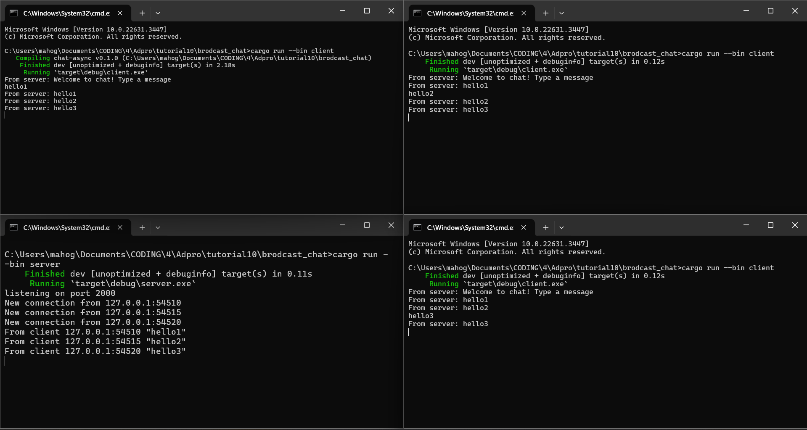
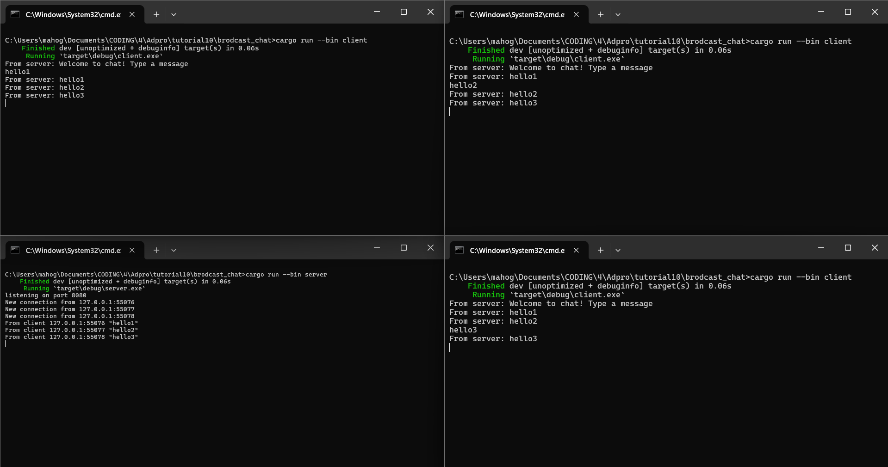
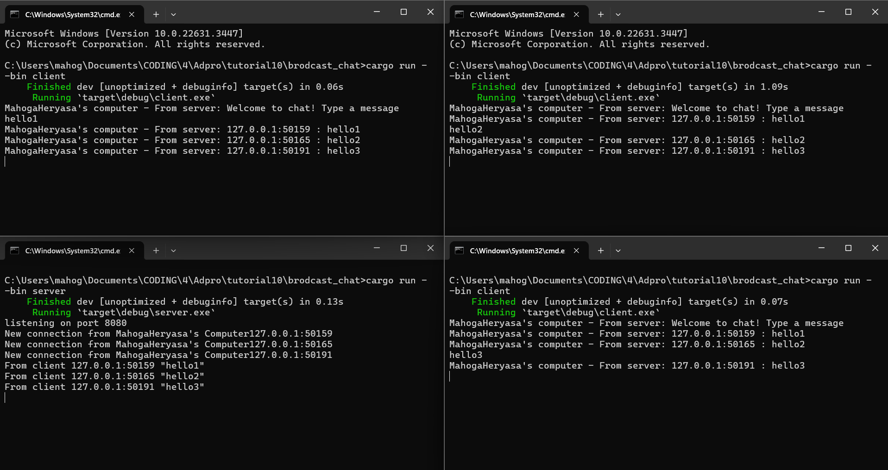

# advprog-modul10-timer

# Mahoga Aribowo Heryasa

# 2206025230

### 2.1. Original code of broadcast chat



Untuk menjalankan satu *server* saya menjalankan `cargo run --bin server` pada satu terminal. Kemudian untuk menjalankan tiga *client*, saya membuka tiga terminal dan menjalankan `cargo run --bin client`. Kemudian saya mencoba memasukkan input pada tiga *client* yang dijalankan. Karena setiap *client* terhubung pada satu *server*, ketika saya memasukkan input pada salah satu *client*, maka yang terjadi adalah input tersebut terlihat pada seluruh terminal *client* setelah input masuk ke server dan dikirimkan kembali ke seluruh client.  

### Experiment 2.2: Modifying port



untuk menggunakan *port* 8080 perlu di modifikasi `client.rs` tepatnya pada,

```rust
...
    let (mut ws_stream, _) =
        ClientBuilder::from_uri(Uri::from_static("ws://127.0.0.1:8080"))
            .connect()
            .await?;
...
```

dan pada `server.rs` tepatnya pada,

```rust
...
    let listener = TcpListener::bind("127.0.0.1:8080").await?;
    println!("listening on port 8080");
...
```

*client* dan *server* harus memiliki port yang sama, jika tidak akan terjadi erorr karena *client* tidak dapat menemukan port yang benar dan program akan di *terminate*

### Experiment 2.3: Small changes, add IP and Port



Berdasarkan teminal diatas, terlihat bahwa terdapat informasi nama *sender* pada setiap *client* dan *server* yang dijalankan. Terlihat bahwa nama sendernya adalah "MahogaHeryasa" yang merupakan nama dari laptop saya. Untuk mendapatkan nama *sender* secara otomatis, saya menambahkan dependency `gethostname` dan menggunakan kode berikut untuk mengambil *hostname*,

```rust
...
let hostname = gethostname().into_string().unwrap_or_else(|_| "unknown".to_string());
...
```

kemudian saya buat *adjustment* pada print statement di client dan server,

`server.rs`
```rust
...
let (socket, addr) = listener.accept().await?;
        println!("New connection from {}'s Computer{}", hostname, addr);
...
```

`client.rs`
```rust
...
if let Some(text) = msg.as_text() {
    println!("{}'s computer - From server: {}", hostname, text);
}
...
```
Dengan begitu output nama sender dapat terlihat ketika ia mengirimkan pesan. 